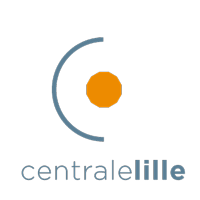
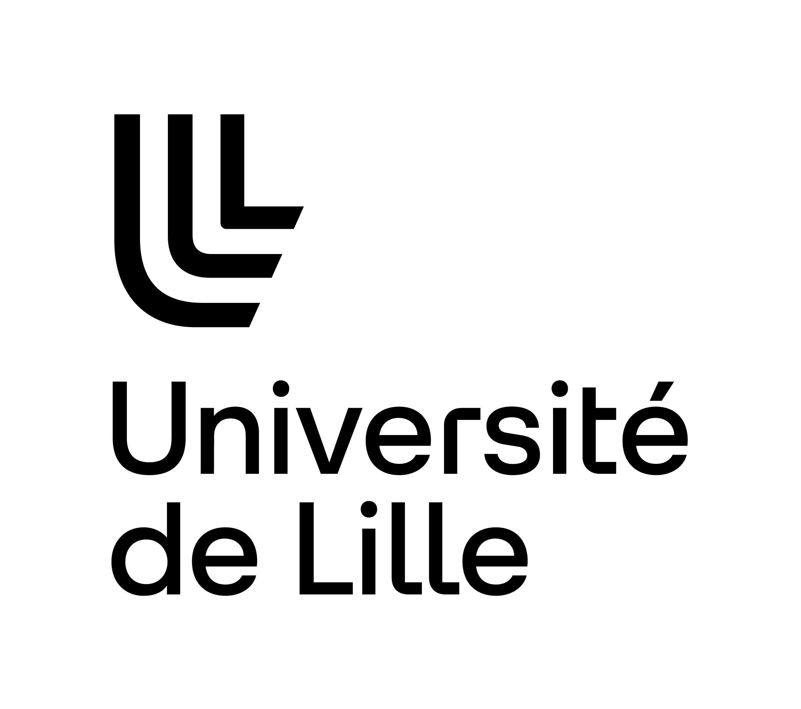

## Education
  __M.Sc. in Data Science__  `2021 - 2023` \\
&emsp; &emsp; &emsp; &emsp; *High level scientific courses in data science, machine learning and signal processing.*

  __B.Sc in Applied Mathematics__  `2018 - 2021` \\
&emsp; &emsp; &emsp; &emsp;  *Foundational to advance courses in mathematics and computer science for data analysis.* 

### B.Sc in Applied Mathematics
**Lille University**, Lille, France  
*2018 - 2021*  

### Baccalauréat Option International
**Lycée Jean Rostand**, Chantilly, France
*2015 - 2017*

## Professional Experience

**Software Engineer - Data @ [Fieldbox](https://www.fieldbox.ai/)**, Bordeaux, France  
*October 2023 - Present*  
- Build and maintain complex data applications for industrial customers. 

**Machine Learning Engineer @ [Fieldbox](https://www.fieldbox.ai/)**, Bordeaux, France  
*April 2023 - September 2023*  
- Designing and building a platform for chatting with a privately hosted LLM.
- Contributing to internal and open source python packages.
- Animating weekly engineering talks.

**Researcher @ [Xlim](https://www.xlim.fr/)**, Poitiers, France
*May 2022 - July 2022*
- Designing and building a system for automatically calibrating cameras when filming high-level table tennis players.

