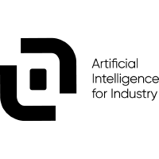

## Education
  __M.Sc. in Data Science__  `2021 - 2023` \\
&emsp; &emsp; &emsp; &emsp; *High level scientific courses in data science, machine learning and signal processing.*

  __B.Sc in Applied Mathematics__  `2018 - 2021` \\
&emsp; &emsp; &emsp; &emsp;  *Foundational to advance courses in mathematics and computer science for data analysis.* 

## Professional Experience

  __Software Engineer - Data @ [Fieldbox](https://www.fieldbox.ai/)__  `October 2023 - Today` \\
&emsp; &emsp; &emsp; &emsp; *Build and maintain complex data applications for industrial customers.* \\
&emsp; &emsp; &emsp; &emsp; &emsp; - *Experstise in python and it's data-science toolkit (kedro, numpy, pandas, ...).* \\
&emsp; &emsp; &emsp; &emsp; &emsp; - *Involved in company's outreach with [public talks](../talks/2024-03-21-dataquitaine) and open source contributions.* 

  __Machine Learning Engineer Intern @ [Fieldbox](https://www.fieldbox.ai/)__  `April 2023 - September 2023` \\
&emsp; &emsp; &emsp; &emsp; - *Design and build a RAG based privately hosted LLM to answer questions on industrial specification manuals.* \\
&emsp; &emsp; &emsp; &emsp; - *Contributing to internal and open source python packages.* \\
&emsp; &emsp; &emsp; &emsp; - *Animating some weekly engineering talks.* 

  __Research Intern @ [Xlim](https://www.xlim.fr/)__  `May 2022 - July 2022` \\
&emsp; &emsp; &emsp; &emsp; - *Designing and building a system for automatically calibrating cameras.* \\
&emsp; &emsp; &emsp; &emsp; - *Dataset augmentation using synthetic data 3D created with Blender.* \\
&emsp; &emsp; &emsp; &emsp; - *Implementing and training a Siamese neural network.* 

